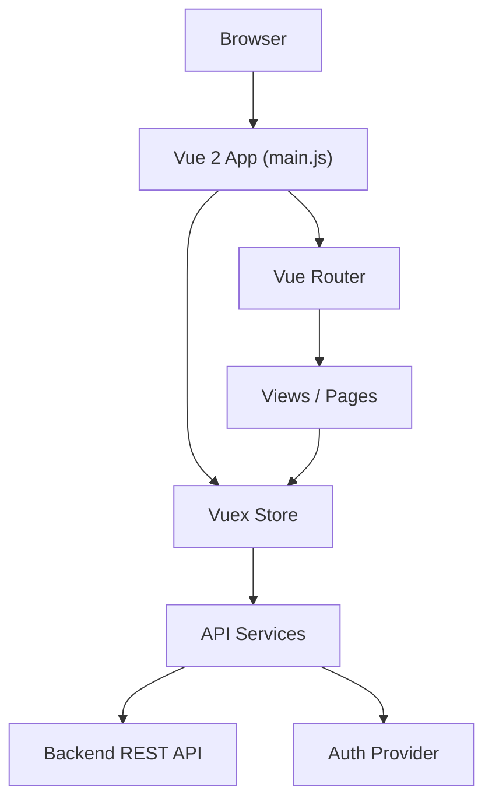

# Copilot Documentation Instructions

> **How to use this file:**
> Drop this file into the root of any Vue 2 project (or at `.github/documentation-vue2-copilot-instructions.md` for automatic pickup by GitHub Copilot).
> Then prompt Copilot with:
> _"Follow the instructions in `.github/documentation-vue2-copilot-instructions.md` and generate full project documentation."_

---

## Your Task

You are a technical documentation engineer. Scan this Vue 2 project thoroughly and produce a complete `docs/` folder with structured documentation files. Also update the `README.md`. Follow every step in this file precisely.

---

## Step 1 — Project Scan Checklist

Before writing a single doc file, scan and extract the following:

| Area | What to look for |
|---|---|
| **Authentication** | `router/index.js` navigation guards, Vuex auth store modules, login/logout components, token handling (localStorage, cookies, Axios interceptors) |
| **Routing & Navigation** | All routes in `router/index.js`, nested routes, lazy-loaded routes, route meta fields, breadcrumb logic |
| **User Actions** | All user-facing components in `views/` and `components/`, form submissions, button handlers, emitted events, modal triggers |
| **API Endpoints** | All `axios` or `fetch` calls across `services/`, `store/`, and components — capture method, URL, payload shape, and response usage |
| **State Management** | Vuex store: modules, state shape, getters, mutations, actions |
| **Reusable Components** | Shared components in `components/`, their props, events, and slots |
| **Environment & Config** | `.env` files, `vue.config.js`, feature flags, base URL configuration |
| **External Integrations** | Third-party SDKs, OAuth providers, analytics, error tracking (Sentry, etc.) |

---

## Step 2 — Create the `docs/` Folder Structure

Create the following files inside a `docs/` folder at the project root:

```
docs/
├── architecture.md
├── authentication.md
├── navigation.md
├── user-actions.md
├── api-endpoints.md
├── state-management.md
├── components.md
├── diagrams/
│   ├── architecture-overview.md      ← Mermaid diagram
│   ├── auth-flow.md                  ← Mermaid sequence diagram
│   ├── navigation-map.md             ← Mermaid flowchart
│   └── state-flow.md                 ← Mermaid stateDiagram or flowchart
└── README.md                         ← docs index / table of contents
//Update the root README.md as well with an overview and links to these docs
```

---

## Step 3 — File-by-File Content Instructions

### `docs/architecture.md`
- High-level overview of the application purpose and domain
- Tech stack (Vue 2 version, Vuex, Vue Router, UI library, build tool)
- Folder structure explanation (what lives where and why)
- Key architectural decisions and patterns used (e.g., module-based Vuex, container/presentational component split)
- Link to `diagrams/architecture-overview.md`

### `docs/authentication.md`
- Authentication strategy (JWT, session, OAuth — detect from code)
- How tokens are stored and refreshed
- Axios interceptor logic (request headers, 401 handling)
- Login and logout flow (step by step)
- Route protection: list every guarded route and the guard logic
- Role or permission-based access if present
- Link to `diagrams/auth-flow.md`

### `docs/navigation.md`
- Complete route table: list every route with its path, component, meta fields, and whether it is auth-guarded
- Nested route trees (render as indented list or table)
- Navigation guards (global, per-route, in-component)
- Programmatic navigation patterns used in the codebase
- Link to `diagrams/navigation-map.md`

### `docs/user-actions.md`
- Group by feature area or page
- For each major view/feature, list:
  - What the user can do (plain English)
  - The component or method that handles it
  - Whether it triggers an API call, Vuex action, or local state change
  - Any validation or confirmation step involved
- Cover: forms, CRUD operations, search/filter, file uploads, modals, notifications, and any destructive actions

### `docs/api-endpoints.md`
- Table or structured list of every API call found in the codebase
- For each endpoint include:

  | Field | Detail |
  |---|---|
  | Method | GET / POST / PUT / PATCH / DELETE |
  | Endpoint | Full path (e.g. `/api/v1/users/:id`) |
  | Description | What it does in plain English |
  | Request payload | Key fields sent (body or query params) |
  | Response shape | Key fields returned |
  | Used in | File(s) / Vuex action / component that calls it |
  | Auth required | Yes / No |

- Group endpoints by resource (e.g. Auth, Users, Orders)
- Note base URL source (env variable or hardcoded)

### `docs/state-management.md`
- Vuex store structure overview
- List every module with: state shape, key getters, mutations, and actions
- Data flow: how components dispatch actions and read state
- Any use of Vuex plugins or persistence (e.g. vuex-persistedstate)
- Link to `diagrams/state-flow.md`

### `docs/components.md`
- Document every shared/reusable component in `components/`
- For each component:

  | Field | Detail |
  |---|---|
  | Name | ComponentName |
  | Purpose | One-line description |
  | Props | Name, type, required, default, description |
  | Events emitted | Event name and payload |
  | Slots | Name and purpose |
  | Dependencies | Other components or store modules it relies on |

---

## Step 4 — Diagrams (Mermaid syntax)

All diagrams must be written in **Mermaid** inside fenced code blocks so they render in GitHub, GitLab, and most doc tools.

### `docs/diagrams/architecture-overview.md`

Use a `graph TD` or `graph LR` diagram. Include:
- Browser → Vue App
- Vue Router → Views
- Views → Vuex Store
- Vuex Store → API Service Layer
- API Service Layer → Backend API
- Any CDN, Auth Provider, or third-party services detected

Example structure (fill in actual names from the project):


### `docs/diagrams/auth-flow.md`

Use a `sequenceDiagram`. Show:
1. User submits login form
2. Component dispatches Vuex auth action
3. Vuex calls API `/auth/login`
4. Token received and stored
5. Router redirects to dashboard
6. Subsequent requests — Axios interceptor attaches token
7. Token expiry / refresh flow if present
8. Logout flow

### `docs/diagrams/navigation-map.md`

Use a `graph TD` flowchart. Show:
- Public routes (accessible without login)
- Protected routes (behind auth guard)
- Redirect logic (unauthenticated → login, post-login → intended route)
- Nested route trees as subgraphs

### `docs/diagrams/state-flow.md`

Use a `stateDiagram-v2` or `graph LR`. Show:
- Component dispatches action → Action calls API → Mutation commits → State updates → Component re-renders
- Show per Vuex module if the app has multiple modules

---

## Step 5 — Update `README.md`

Replace or update the root `README.md` to include:

1. **Project title and one-paragraph description**
2. **Tech stack badges** (Vue 2, Vuex, Vue Router, etc.)
3. **Prerequisites** (Node version, package manager)
4. **Getting started** (clone, install, env setup, run, build)
5. **Environment variables** — table of all `.env` keys, their purpose, and whether they are required
6. **Documentation index** — link to every file in `docs/`
7. **Architecture summary** — 2–3 sentence overview + link to `docs/architecture.md`
8. **Authentication summary** — how auth works in one paragraph + link to `docs/authentication.md`
9. **Contributing guidelines** (brief)
10. **License**

---

## Step 6 — Quality Rules

Apply these rules to every file you produce:

- **Be specific** — never write "handles user data"; write "dispatches `auth/login` with `{ email, password }` and stores the returned JWT in `localStorage` under the key `auth_token`"
- **Reflect the actual code** — only document what you find; do not invent endpoints, routes, or components
- **Flag gaps** — if a section cannot be fully documented due to missing information, add a `> ⚠️ TODO:` callout explaining what needs to be filled in manually
- **Keep diagrams accurate** — Mermaid node names must match actual component/module names in the project
- **Use consistent naming** — match the exact route paths, component names, and Vuex module names from the source code
- **Plain English first** — every technical section should open with a one-paragraph plain-English summary before diving into tables or code

---

## Notes for Copilot

- Scan recursively: `src/`, `router/`, `store/`, `services/`, `views/`, `components/`, `plugins/`, `utils/`, `api/`
- If the project uses a monorepo, scope the scan to the Vue app package
- Do not skip files because they seem trivial — a utility file might contain the only instance of a specific API call
- If you find conflicting patterns (e.g. both Axios and fetch used), document both and note the inconsistency
- Produce all files in a single pass; do not ask clarifying questions unless a file is completely absent from the project
